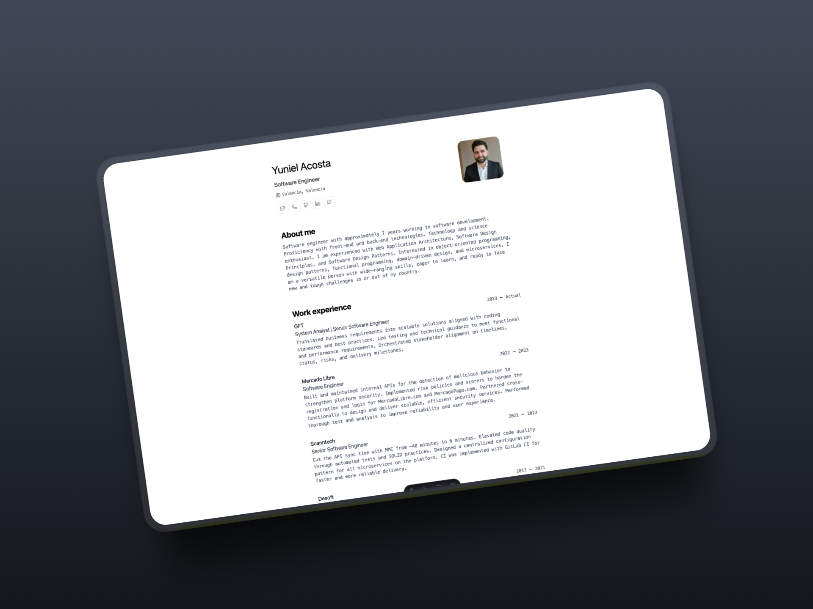

# Minimal résumé layout for web and PDF


A minimal, print-friendly résumé/portfolio site built with Astro and a
JSON resume as the data source. This repository is based on the
`midudev/minimalist-portfolio-json` template and has been adapted and
published as a new project at
[https://github.com/yacosta738/portfolio-cv](https://github.com/yacosta738/portfolio-cv).
The design is inspired by Bartosz Jarocki's CV template.

---

## Badges




## Contribute

Contributions are welcome. See `CONTRIBUTING.md` for guidelines on how
to contribute. If you use or fork this repository, please consider
attributing the original template: `midudev/minimalist-portfolio-json`.

## Release & commits

This repository uses semantic-release to automate package versioning
and publishing. Commits should follow the Conventional Commits
convention.

## Stack

- [Astro](https://astro.build/)
- [TypeScript](https://www.typescriptlang.org/)
- [Ninja Keys](https://github.com/ssleptsov/ninja-keys)

## Getting started

1. Enable pnpm on macOS, WSL, or Linux:

```bash
corepack enable
corepack prepare pnpm@latest --activate
```

1. Clone this repository or initialize from the original template if you prefer:

    ```bash
    git clone https://github.com/yacosta738/portfolio-cv.git
    cd portfolio-cv
    pnpm install
    ```

2. Add your content by editing `cv.json`.

3. Start the development server:

```bash
pnpm dev
```

Open [http://localhost:4321](http://localhost:4321) in your browser to
see the site.

## Commands

| Command        | Description                         |
| -------------- | ----------------------------------- |
| `pnpm dev`     | Start development server (localhost:4321) |
| `pnpm build`   | Build production into `./dist`      |
| `pnpm preview` | Preview production build locally    |

## License

MIT — Created by Yuniel acosta ([yunielacosta.com](https://yunielacosta.com)).

## Resources

- jsonresume schema: [https://jsonresume.org/schema/](https://jsonresume.org/schema/)
- Original design: [https://github.com/BartoszJarocki/cv](https://github.com/BartoszJarocki/cv)
- Project template: [https://github.com/midudev/minimalist-portfolio-json](https://github.com/midudev/minimalist-portfolio-json)
